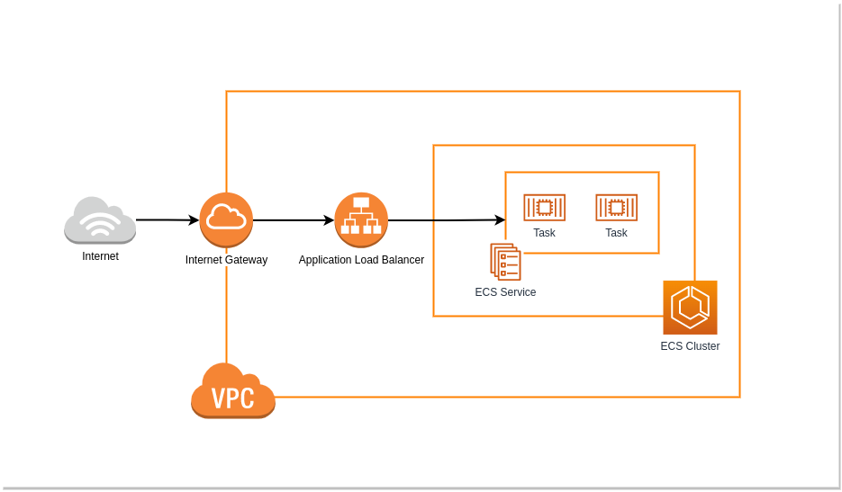

# ECS Fargate template with Terraform
The main purpose of this template was to practice my skills with Terraform and AWS.

If you are going to use this template in your project, don't forget to update `vars-{ENV}.tfvars` file to include your own values.

## Architecture


### Deployment
To provision resources, execute:
```bash
$ terraform apply -var-file vars-dev.tfvars
```

If you want to drop the stack, execute:
```bash
$ terraform destroy -var-file vars-dev.tfvars
```